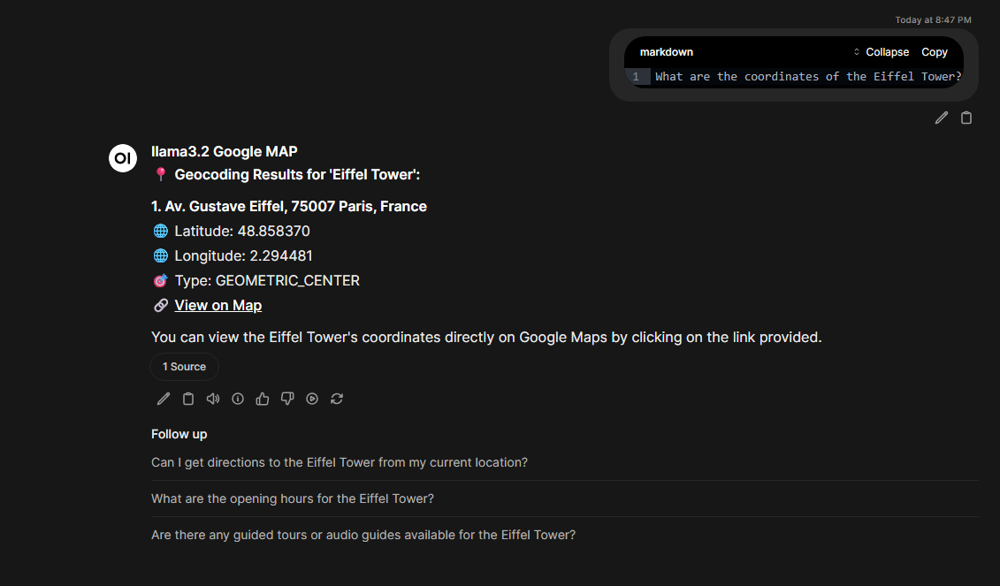

# HeyPico Google Maps Integration

An AI-powered Google Maps integration system that enables seamless location search, directions, and map visualization within Open WebUI chat interface with secure API key management and embedded static maps.


## Table of Contents

- [Overview](#overview)
- [Tech Stack](#tech-stack)
- [Features](#features)
- [Setup Instructions](#setup-instructions)
- [Environment Variables](#environment-variables)
- [API Testing Examples](#api-testing-examples)
- [Docker Deployment](#docker-deployment)
- [Open WebUI Integration](#open-webui-integration)
- [Security Considerations](#security-considerations)
- [Troubleshooting](#troubleshooting)
- [Screenshots](#screenshots)
- [Known Limitations](#known-limitations)
- [Future Improvements](#future-improvements)

## Overview

This system solves the problem of integrating Google Maps functionality into AI chat interfaces while maintaining security and providing rich visual feedback. The system:

1. **Secures API keys** - All Google Maps API keys are handled server-side, never exposed to clients
2. **Provides rich visual feedback** - Static map images with location markers display directly in chat
3. **Enables natural location queries** - Ask questions like "Find restaurants near Times Square" or "Get directions from JFK to Manhattan"
4. **Supports multiple map types** - Search results, directions, geocoding, and place details
5. **Offers seamless user experience** - Clickable links for interactive Google Maps access

### Key Capabilities

- **Intelligent Place Search**: Find restaurants, gas stations, hotels, and more with radius-based searching
- **Turn-by-Turn Directions**: Get detailed directions with distance, duration, and route maps
- **Location Geocoding**: Convert addresses to coordinates and vice versa
- **Static Map Generation**: Display maps with custom markers directly in chat
- **Secure API Proxy**: Backend-only API key handling with CORS-enabled endpoints
- **Docker-Native Deployment**: Complete containerized solution with docker-compose

## Tech Stack

### Backend
- **FastAPI** - High-performance Python web framework with automatic OpenAPI documentation
- **Google Maps API** - Places API, Directions API, Geocoding API, Static Maps API, Embed API
- **Uvicorn** - ASGI server for production deployment
- **Pydantic** - Data validation and serialization

### Frontend/Interface
- **Open WebUI** - Web-based chat interface for AI interactions
- **Markdown Rendering** - Rich formatting with images and links
- **Custom Tools** - Python-based tool integration for Google Maps functionality

### Infrastructure
- **Docker & Docker Compose** - Container orchestration and service management
- **Docker Secrets** - Secure API key management

## Features

### 🔍 Place Search
- **Radius-based searching** - Find places within specific distance from a location
- **Category filtering** - Search for specific types of places (restaurants, hotels, gas stations)
- **Rich result display** - Names, addresses, ratings, phone numbers, websites
- **Visual map markers** - Numbered markers on static maps showing search results
- **Direct Google Maps links** - One-click access to full interactive maps

### 🧭 Turn-by-Turn Directions
- **Multiple travel modes** - Driving, walking, bicycling, transit
- **Detailed step-by-step instructions** - Complete turn-by-turn guidance
- **Distance and duration** - Precise calculations for route planning
- **Route visualization** - Static maps showing start point, end point, and route path
- **Interactive map links** - Direct access to Google Maps navigation

### 📍 Geocoding Services
- **Address to coordinates** - Convert any address to latitude/longitude
- **Coordinates to address** - Reverse geocoding for location identification
- **Multiple result support** - Handle ambiguous addresses with multiple options
- **Location type identification** - Distinguish between addresses, landmarks, etc.

### 🔒 Security Features
- **Server-side API key management** - No API key exposure to clients
- **CORS-enabled endpoints** - Secure cross-origin requests
- **Request validation** - Input sanitization and rate limiting ready
- **Docker secrets support** - Encrypted credential storage

### 🐳 Docker Integration
- **Multi-container architecture** - Separate backend and frontend containers
- **Health checks** - Automatic service monitoring and restart
- **Volume mounting** - Persistent data storage and configuration
- **Network isolation** - Container-to-container communication security

## Setup Instructions

### Prerequisites
- Docker and Docker Compose installed
- Google Maps API key (enable: Places API, Directions API, Geocoding API, Static Maps API, Embed API)
- Git for cloning the repository

### Quick Start

1. **Clone the repository**
   ```bash
   git clone <repository-url>
   cd HeyPico
   ```

2. **Set up API key**
   ```bash
   # Create secrets directory
   mkdir -p secrets

   # Add your Google Maps API key
   echo "YOUR_GOOGLE_MAPS_API_KEY" > secrets/google_maps_api_key.txt
   ```

3. **Configure environment (optional)**
   ```bash
   cp .env.example .env
   # Edit .env with your custom settings
   ```

4. **Start the services**
   ```bash
   docker-compose up -d
   ```

5. **Access the application**
   - Open WebUI: http://localhost:3000
   - Backend API: http://localhost:8000
   - API Documentation: http://localhost:8000/docs

### Manual Installation

#### Backend Setup
1. **Install Python dependencies**
   ```bash
   cd backend
   pip install -r requirements.txt
   ```

2. **Set environment variables**
   ```bash
   export GOOGLE_MAPS_API_KEY="your_api_key_here"
   export CORS_ORIGINS="http://localhost:3000"
   ```

3. **Run the backend**
   ```bash
   uvicorn app.main:app --host 0.0.0.0 --port 8000 --reload
   ```

#### Open WebUI Setup
1. **Install Open WebUI**
   ```bash
   docker run -d -p 3000:8080 --add-host=host.docker.internal:host-gateway -v open-webui:/app/backend/data --name open-webui --restart always ghcr.io/open-webui/open-webui:main
   ```

2. **Configure the Google Maps tool**
   - Copy the tool from `open-webui/tools/google_maps_tool.py`
   - Install in your Open WebUI tools directory
   - Configure API URLs in the tool settings

## Environment Variables

### Required Variables
- `GOOGLE_MAPS_API_KEY` - Your Google Maps API key (must have Places, Directions, Geocoding, Static Maps, Embed APIs enabled)

### Backend Configuration
- `BACKEND_API_URL` - Backend API URL for tool-to-backend communication (default: `http://fastapi-backend:8000/api/maps`)
- `BROWSER_API_URL` - Browser-accessible API URL for maps display (default: `http://localhost:8000/api/maps`)
- `CORS_ORIGINS` - Allowed CORS origins (default: `http://localhost:3000`)
- `APP_NAME` - Application name (default: `HeyPico Maps API`)
- `LOG_LEVEL` - Logging level (default: `INFO`)

### Open WebUI Configuration
- `WEBUI_NAME` - Display name for the web interface (default: `HeyPico Maps AI`)
- `ENABLE_SIGNUP` - Allow user registration (default: `true`)
- `DEFAULT_MODELS` - Default AI models to use (default: `llama3.2:latest`)
- `ENABLE_RAG` - Enable retrieval-augmented generation (default: `false`)
- `ENABLE_WEB_SEARCH` - Enable web search capabilities (default: `false`)

### Docker Configuration
- `ENABLE_IFRAME_SANDBOX` - Control iframe sandbox behavior (default: `false`)
- `WEBUI_IFRAME_ORIGINS` - Allowed iframe origins (default: `*`)
- `SHOW_MESSAGE_DURATION` - Message display duration in milliseconds (default: `0`)

## API Testing Examples

### Place Search
```bash
# Search for restaurants in New York
curl -X POST "http://localhost:8000/api/maps/search" \
  -H "Content-Type: application/json" \
  -d '{
    "query": "pizza restaurants",
    "location": "New York, NY",
    "radius": 5000
  }'
```

### Get Directions
```bash
# Get directions from JFK to Times Square
curl -X POST "http://localhost:8000/api/maps/directions" \
  -H "Content-Type: application/json" \
  -d '{
    "origin": "JFK Airport, New York",
    "destination": "Times Square, New York",
    "mode": "driving"
  }'
```

### Geocoding
```bash
# Convert address to coordinates
curl -X POST "http://localhost:8000/api/maps/geocode" \
  -H "Content-Type: application/json" \
  -d '{
    "address": "1600 Amphitheatre Parkway, Mountain View, CA"
  }'
```

### Static Map Generation
```bash
# Generate static map with markers
curl -X GET "http://localhost:8000/api/maps/static-image?q=37.7749,-122.4194&width=600&height=400&markers=markers=color:red|label:1|37.7749,-122.4194" \
  -o map.png
```

## Docker Deployment

### Production Deployment

1. **Environment Configuration**
   ```bash
   # Production environment file
   cat > .env << EOF
   GOOGLE_MAPS_API_KEY=${GOOGLE_MAPS_API_KEY}
   CORS_ORIGINS=https://yourdomain.com
   APP_NAME=HeyPico Maps API
   LOG_LEVEL=WARNING
   EOF
   ```

2. **Secure API Key Setup**
   ```bash
   # Use Docker secrets for production
   echo "${GOOGLE_MAPS_API_KEY}" | docker secret create google_maps_api_key -
   ```

3. **Deploy with Docker Compose**
   ```bash
   docker-compose -f docker-compose.yml -f docker-compose.prod.yml up -d
   ```

### Health Monitoring
- Backend health check: `GET /api/health`
- Open WebUI health check: `GET /health`
- Container status: `docker-compose ps`
- Logs: `docker-compose logs -f`

## Open WebUI Integration

### Tool Installation
1. **Copy the Google Maps tool**
   ```bash
   cp open-webui/tools/google_maps_tool.py /path/to/open-webui/data/tools/
   ```

2. **Restart Open WebUI**
   ```bash
   docker restart open-webui
   ```

3. **Configure Tool Settings**
   - Set `BACKEND_API_URL` for container-to-container communication
   - Set `BROWSER_API_URL` for browser-accessible URLs
   - Adjust `MAX_RESULTS_DISPLAY` and `REQUEST_TIMEOUT` as needed

### Usage Examples

**Search for Places:**
```
"Find Italian restaurants within 1 mile of Central Park"
"Show me gas stations near Times Square"
"What are the best coffee shops in San Francisco?"
```

**Get Directions:**
```
"Give me directions from Brooklyn to Manhattan"
"Show me the walking route from Central Park to MoMA"
"How do I get from JFK Airport to Times Square by public transit?"
```

**Geocoding:**
```
"What are the coordinates of the Eiffel Tower?"
"Give me the latitude and longitude of Times Square"
"Convert 1600 Amphitheatre Parkway, Mountain View, CA to coordinates"
```

## Security Considerations

### API Key Protection
- **Server-side only** - API keys are never sent to clients
- **Docker secrets** - Use encrypted storage for production deployments
- **Environment isolation** - Separate development and production keys
- **Rate limiting** - Implement request throttling (Google Maps API limits)

### Network Security
- **CORS configuration** - Restrict origins to trusted domains
- **HTTPS in production** - Use SSL/TLS for all communications
- **Container isolation** - Docker network segmentation
- **API authentication** - Consider adding API key or JWT authentication

### Data Privacy
- **No data persistence** - Search queries are not stored by default
- **Minimal logging** - Only essential request logging
- **Cache management** - Implement appropriate cache TTLs
- **GDPR compliance** - Consider data retention policies

## Troubleshooting

### Common Issues

**1. API Key Not Working**
- Verify API key has all required Google Maps APIs enabled
- Check API key restrictions (IP, domain, application)
- Ensure billing is enabled for your Google Cloud project

**2. Maps Not Displaying**
- Check container network connectivity: `docker network ls`
- Verify BROWSER_API_URL is accessible from browser
- Test backend directly: `curl http://localhost:8000/api/maps/health`

**3. Markers Not Showing**
- Verify marker parameter encoding in URL
- Check backend logs for Google Maps API errors
- Test with simple marker: `markers=color:red|40.7128,-74.0060`

**4. CORS Errors**
- Verify CORS_ORIGINS includes your frontend domain
- Check if using correct protocol (http vs https)
- Ensure browser isn't blocking cross-origin requests

### Debug Commands
```bash
# Check container status
docker-compose ps

# View backend logs
docker-compose logs -f fastapi-backend

# View Open WebUI logs
docker-compose logs -f open-webui

# Test API connectivity
curl http://localhost:8000/api/health

# Test static map generation
curl -I "http://localhost:8000/api/maps/static-image?q=37.7749,-122.4194&width=600&height=400"
```

## Screenshots

### Place Search Results


*Static map with numbered markers showing restaurant search results in Purwakarta Indonesia*

### Route Directions


*Turn-by-turn directions with route map showing path from Brooklyn to Manhattan*

### Geocoding Results


*Geocoding service converting addresses to precise coordinates with location details*

## Known Limitations

### Google Maps API Limitations
- **Quota limits** - Free tier has daily usage limits
- **Rate limiting** - QPS (queries per second) restrictions
- **Pricing** - Static Maps API and Directions API have usage costs
- **Geocoding limits** - Address geocoding has separate quotas

### Technical Limitations
- **No interactive maps in Open WebUI** - Due to Open WebUI's markdown rendering and iframe sandbox restrictions, only static map images with markers can be displayed directly in chat. Interactive maps are accessible via clickable Google Maps links
- **No real-time traffic** - Static maps don't show live traffic conditions
- **Marker limits** - Maximum markers per static map (Google API limit)
- **Image caching** - Static maps are cached for 1 hour
- **No street view** - Integration focuses on maps and directions, not street view
